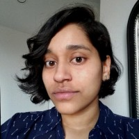

# README
https://usf-cs360-spring2020.github.io/project-cbudamagunta1/

**Name:** Chaitrika Budamagunta   
**Email:** <cbudamagunta@dons.usfca.edu>

I am a **computer science major** graduating in **May 2020**. I am also a theater minor and love finding ways to blend tech and art.

#   

This is a template website using [Markdown](https://guides.github.com/features/mastering-markdown/), [Jekyll](https://jekyllrb.com/), and [Github Pages](https://pages.github.com/). Designed to be modified (including this README file).

*Template based on: <https://github.com/usf-cs360-spring2020/template-basic>*
